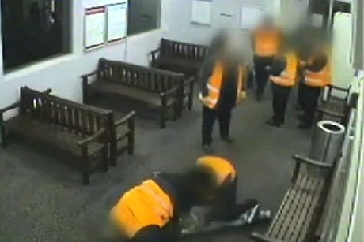

 
#    Week 2 Blog Post - Road To Nowhere
 
The aim of our project is to explore and attempt to help with the issues of public transport in Melbourne.

It is quite easy to find article upon article complaining about overcrowded transport, faulty myki cards, a lack of Myki Top up machines and endless complaints about AOs.

Nearly every day commuters are faced with delays, late buses and trains, or being plagued by ticket inspectors. This issue is a huge challenge to solve, so our solution will attempt to assist commuters in their daily struggles.

According to the Herald Sun, "Customers made 282 complaints against authorized officers this financial year." Among these reports were ticket inspectors using overly "heavy handed" approaches at dealing with ticket evading. Which even lead a woman to be "traumatised" by ticket inspectors.

When we use public transport in Melbourne, we may often be stressed by running late. Add being hassled and intimidated by ticket inspectors on top of this and for some it may be too much. Being stopped and interrogated by Authorised Officers (AO's) or ticket inspectors can often unnecessarily slow down legitimate paying commuters on their trips.

Road To Nowhere will uncover the true problems within Melbourne's public transport system and provide a useful web application to help travellers find the fastest most hassle free route around Melbourne's transport system.

Postgraduate students are also blatently denied concession status despite them still being students. PHD or Masters students do not earn any more money than undergraduate students. How is this fair? This application does not intend to make fair evasion possible but instead help level the playing field.

Road To Nowhere will uncover the true problems within Melbourne's public transport system and provide a useful web application to help travellers.

http://www.dailymail.co.uk/news/article-4248460/Single-mum-traumatised-ticket-inspectors.html

http://www.heraldsun.com.au/news/victoria/ticket-inspectors-intimidating-passengers-on-melbournes-trains-and-trams/news-story/28c5dea955bc05cc6a99350235b66e5e

http://mobile.abc.net.au/news/2016-11-17/public-transport-ticket-inspector-complaints-rise-16-per-cent/8030770

http://www.ptua.org.au/melbourne/problem/

https://www.facebook.com/FaresFairPTV/

http://www.theage.com.au/victoria/myki-still-a-disaster-and-public-transport-victoria-is-not-monitoring-it-properly-auditorgeneral-20150610-ghkj77.html

#    Week 3 Blog Post - Road To Nowhere

Due to ethical reasons, we've decided to change our apprroach to the top of transport in Melbourne. Instead targeting the lack of communication on PTVs behalf in giving it's customers important information about their travel route. Important information like the ability to discover whether a bus, train or tram is running late is too difficult to access and is not readily accessible.

For buses, there are "Smart Buses", which offer an ability to see how far the bus is away, however this is only limited to a particular set of busses which run only in Melbourne's East and the information is not readily accessible online or in an app format.

For trams, a solution called tramTRACKER currently exists however the scope of the app is limited to only trams, and finding the correct stop your are closest to is an issue, as the app simply gives you a large list of all nearby stops, based on your location, causing users to have to trawl through it to find their desired stop.

For trains there are displays at stations which tell you how far a train is away, but that information is not readily available to customers online or on a connecting tram for example. This information is also very delayed in reaching customers and only high profile problems or accidents are ever reported, leaving small inconvenient delays unreported, frustrating the users.

PTV recommends "checking their website for updates" however this provides only information for every single service and it is difficult to and time consuming to locate information specific to route. Our app will aim to save or favourite a specific route to receive notifications based on that particular route, such that the user will always be aware of current or upcoming works on their route. The PTV site, also only notifies user who are "...subscrib[ed] to PTV's weekly travel update email" about upcomign railway works, unless user actively look up their tain line.

In addition, upon accessing a line or route within the PTV phone app, it has no notifications about upcoming Railway work on that specific route, or current work being undertaken. However it does proceed to notify the user if the Journey planner aspect is being used, leading to some small inconsistencies in which may possibly have been a consistent streamlined process.

Our aim is to attempt to provide a solution to unify all the current solutions into one user driven application which will attempt to report delays live and to update all users down the line of whatever the delay is on. The application will attempt to map any user reported issues to help consumers visualise where any issues are. Bundled into the proposed applications are little features including notifications about when Concession Cards are expiring, low money notifications and notifications letting the user know when their last train will be.

http://www.news.com.au/national/victoria/stay-out-of-the-cbd-melbourne-police-warn-as-city-in-lockdown/news-story/2a8b9065b9d7e5f932809217c6723cce

http://www.theage.com.au/victoria/melbourne-train-delays-peakhour-commuters-face-lengthy-delays-due-to-signalling-fault-20160913-grfkd9.html
